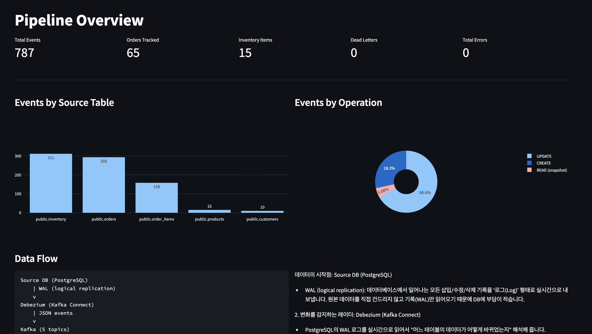
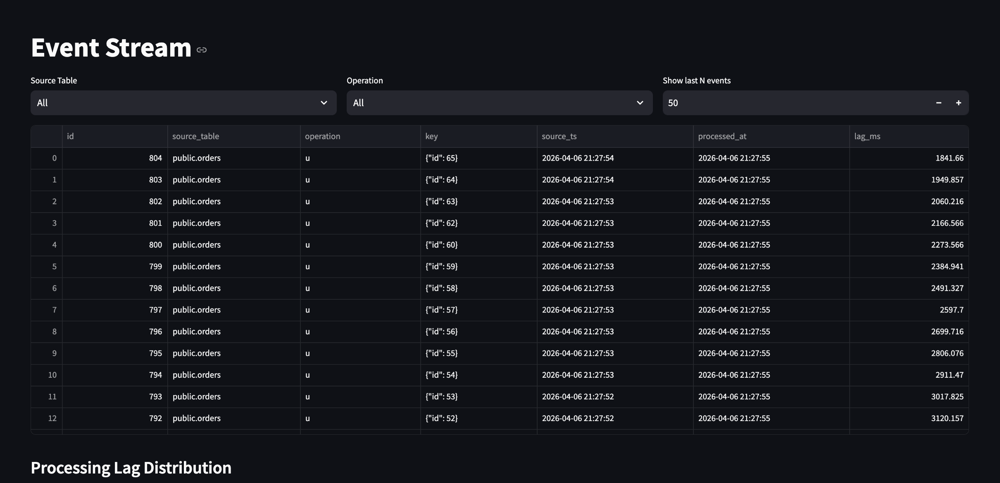
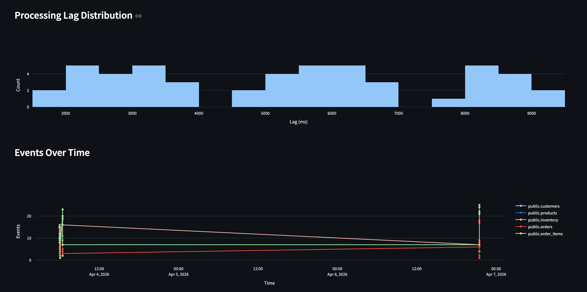
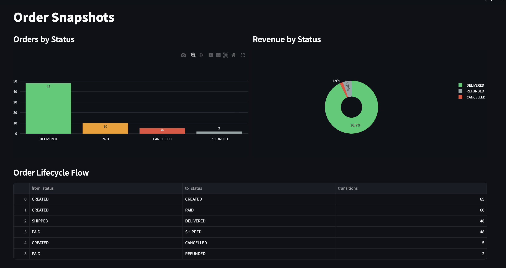
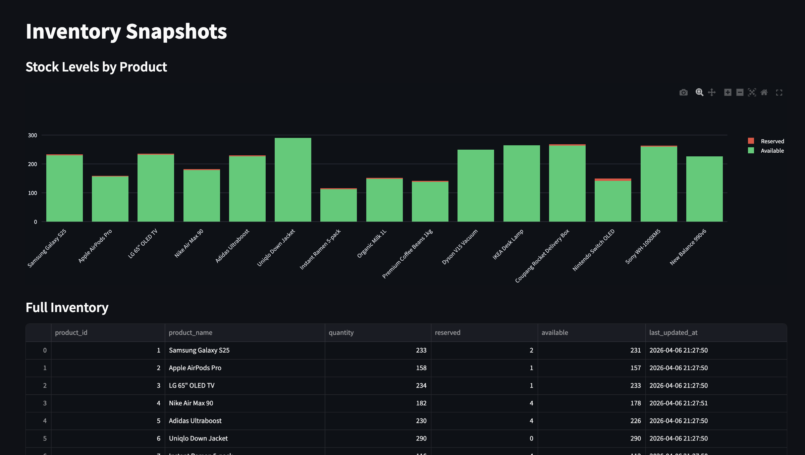

# CDC-Based Event Sourcing Pipeline

Real-time Change Data Capture pipeline that streams database changes through Kafka and builds materialized snapshots for analytics.

## Problem

Most data pipelines run on a schedule — check for changes every hour, every 10 minutes. This works for batch analytics, but it has real gaps:

- **Missed intermediate states**: if an order goes CREATED → PAID → SHIPPED between polls, you only see SHIPPED
- **Deletes are invisible**: polling with SELECT can't detect deleted rows
- **Wasted DB load**: polling queries the source DB on every cycle even when nothing changed

CDC (Change Data Capture) solves all three by reading the database's own change log instead of polling.

## Approach

```
Source DB (PostgreSQL)
    │  WAL (logical replication)
    v
Debezium (Kafka Connect)
    │  JSON change events
    v
Apache Kafka (5 topics)
    │  Python consumer (confluent-kafka)
    v
Analytics DB
    ├── event_log        (append-only, every change recorded)
    ├── order_snapshots   (current state of each order)
    ├── inventory_snapshots (current stock levels)
    ├── processing_metrics (consumer health per minute)
    └── dead_letter_events (failed events for investigation)
```

The source database simulates an e-commerce system with orders, products, inventory, and customers. A simulator generates realistic order lifecycles (create → pay → ship → deliver, with 10% cancellations and 5% refunds).

Debezium watches the PostgreSQL WAL and publishes every row change to Kafka. A Python consumer reads those events, stores them in an append-only event log, and updates materialized snapshots.

## Key Design Decisions

| Decision                   | Why                                                                            |
| -------------------------- | ------------------------------------------------------------------------------ |
| WAL-based CDC over polling | Captures every state transition, zero load on source DB                        |
| Kafka over RabbitMQ        | Durable log with replay capability for event sourcing                          |
| JSONB event log            | Schema-agnostic — new columns in source DB just appear as new JSON fields      |
| UUID5-based dedup          | Deterministic event IDs from table + LSN + txId + key. Same event = same ID    |
| Materialized snapshots     | Current state derived from events, not copied from source. Can rebuild anytime |
| Dead letter queue          | Failed events get stored, not dropped. Pipeline keeps running                  |

Full rationale in [02-DECISIONS.md](02-DECISIONS.md) (8 ADRs).

## What I Learned

- **Debezium runs inside Kafka Connect** — it's not a standalone tool. You register connectors via REST API. Took a while to understand this architecture.
- **Decimal columns come as base64 by default** in Debezium events. Need `decimal.handling.mode: "string"` in connector config. This is a common production gotcha.
- **WAL bloat is a real risk** — if the consumer stops, PostgreSQL keeps WAL data for the replication slot. Can fill the disk. Production systems need heartbeat events and monitoring.
- **Out-of-order events happen** even in a single-partition Kafka topic because Debezium batches transactions. Tracking per-table timestamps caught this.
- **plotly.express has compatibility issues on Python 3.9** with newer narwhals versions. Switched to plotly.graph_objects with `.tolist()` conversion.

Process documented in [02-JOURNAL.md](02-JOURNAL.md).

## Limitations

- **Single consumer**: no partitioned consumption or consumer groups. Works for demo scale (~50 events/min), not for production throughput.
- **No exactly-once semantics**: uses at-least-once with dedup. A crash between DB commit and Kafka offset commit could reprocess events (handled by UUID5 dedup, but not zero-cost).
- **No schema registry**: relies on JSONB flexibility instead of Avro/Protobuf with Confluent Schema Registry. Fine for this scale, but production CDC pipelines should validate schemas.
- **Zookeeper dependency**: using Debezium's bundled Zookeeper image. Production Kafka (3.x+) can run in KRaft mode without Zookeeper.
- **Docker stack uses ~2-3 GB RAM**: Kafka + Zookeeper + Debezium are heavy. Not practical on a small laptop without closing other apps.

## Quick Start

### Prerequisites

- Docker Desktop (4+ GB RAM allocated)
- Python 3.9+
- pip packages: `psycopg2-binary confluent-kafka streamlit pandas plotly`

### 1. Start Infrastructure

```bash
cd 02-cdc-event-pipeline
docker compose up -d
```

Wait ~30 seconds for all services to be healthy, then register the Debezium connector:

```bash
bash scripts/register_connector.sh
```

### 2. Generate Test Data

```bash
cd src
python3 -c "from simulator import run_burst; run_burst(20)"
```

### 3. Start the Consumer

```bash
cd src
python3 run_consumer.py
```

### 4. View the Dashboard

In a new terminal:

```bash
streamlit run src/dashboard.py
```

Opens at `http://localhost:8501`. Use the sidebar to navigate between 5 pages:

## Dashboard

**Pipeline Overview** -

Top-level health check. Five summary metrics (total events, orders tracked, inventory items, dead letters, errors) give an instant read on pipeline status. The bar chart breaks down events by source table: inventory and orders dominate because each order lifecycle touches both. The pie chart shows operation mix (66% UPDATE, 28% CREATE, 5% READ) which makes sense because orders go through 4+ state transitions per lifecycle. The Data Flow section on the bottom shows the full pipeline architecture.

**Event Stream** -

Filterable event log with per-event lag measurement.

**Processing Lag & Timeline** -

The histogram shows how processing lag is distributed - most events land in the 1-3 second range, with a long tail up to 9 seconds for events that were queued in Kafka during bursts. The two clusters (Apr 4 and Apr 7) in bottom graph correspond to two separate simulator burst runs. You can see that customers and products only fire once (seed data), while orders and inventory generate continuous events.

**Order Snapshots** -

Current state of all orders derived from CDC events. The status bar chart shows the order lifecycle distribution — 48 delivered, 10 paid (in progress), 5 cancelled, 2 refunded. The revenue pie chart shows 92.7% of revenue comes from delivered orders. The Order Lifecycle Flow table at the bottom shows actual state transitions captured by CDC: 65 CREATED events, 60 CREATED→PAID transitions, 48 SHIPPED→DELIVERED, and 5 CREATED→CANCELLED.

**Inventory Snapshots** -

Real-time stock levels for all 15 products, computed from CDC events. The stacked bar chart shows available (green) vs reserved (red) quantities. Products like Uniqlo Down Jacket (290 available, 0 reserved) have plenty of stock, while Nike Air Max 90 (178 available, 4 reserved) shows active reservation. The `available` column is a PostgreSQL GENERATED column that auto-computes `quantity - reserved`. The table below shows exact numbers with the last update timestamp.

### 5. Monitor via CLI

```bash
python3 src/monitor.py             # full status
python3 src/monitor.py --watch     # auto-refresh every 5s
python3 src/monitor.py metrics     # just performance numbers
```

### 6. Verify Consistency

```bash
bash scripts/verify_consistency.sh
```

Compares analytics snapshots against source DB to prove they match.

## Project Structure

```
02-cdc-event-pipeline/
├── docker-compose.yml          # 5 services (source-db, analytics-db, zookeeper, kafka, debezium)
├── db/
│   ├── source_init.sql         # 5 source tables with REPLICA IDENTITY FULL
│   ├── seed_data.sql           # 10 customers, 15 products, inventory
│   └── analytics_init.sql      # event_log, snapshots, metrics, dead letter
├── scripts/
│   ├── register_connector.sh   # Debezium connector registration
│   ├── peek_topics.sh          # Kafka topic inspection
│   └── verify_consistency.sh   # Source vs snapshot comparison
├── src/
│   ├── simulator.py            # Order lifecycle simulator (burst + continuous)
│   ├── dashboard.py            # Streamlit dashboard (5 pages)
│   ├── monitor.py              # CLI pipeline monitor
│   ├── run_consumer.py         # Consumer entry point
│   └── consumer/
│       ├── config.py           # Environment-based settings
│       ├── db.py               # Analytics DB connection
│       ├── event_log.py        # Append-only storage with UUID5 dedup
│       ├── snapshots.py        # Materialized order + inventory snapshots
│       ├── metrics.py          # Per-window processing metrics
│       ├── dead_letter.py      # Failed event handling
│       └── runner.py           # Main Kafka consumer loop
├── tests/                      # 21 unit tests
├── 02-CONTEXT.md
├── 02-SCHEMA-DESIGN.md
├── 02-DECISIONS.md             # 8 ADRs
├── 02-ROADMAP.md
└── 02-JOURNAL.md               # Build process with verification results
```

## Tech Stack

- PostgreSQL 16 (source + analytics databases)
- Debezium 2.7 (CDC connector via Kafka Connect)
- Apache Kafka 2.7 (event streaming)
- Python + confluent-kafka (consumer)
- Streamlit + Plotly (dashboard)
- Docker Compose (local orchestration)

## Cost Estimate (Production)

See [docs/cost-analysis.md](docs/cost-analysis.md) for full breakdown. Summary:

| Component                        | AWS (monthly)  |
| -------------------------------- | -------------- |
| Kafka (MSK t3.small x2)          | ~$30           |
| Source DB (RDS db.t3.micro)      | ~$15           |
| Analytics DB (RDS db.t3.micro)   | ~$15           |
| Debezium (ECS Fargate 0.5 vCPU)  | ~$15           |
| Consumer (ECS Fargate 0.25 vCPU) | ~$8            |
| **Total**                        | **~$83/month** |
